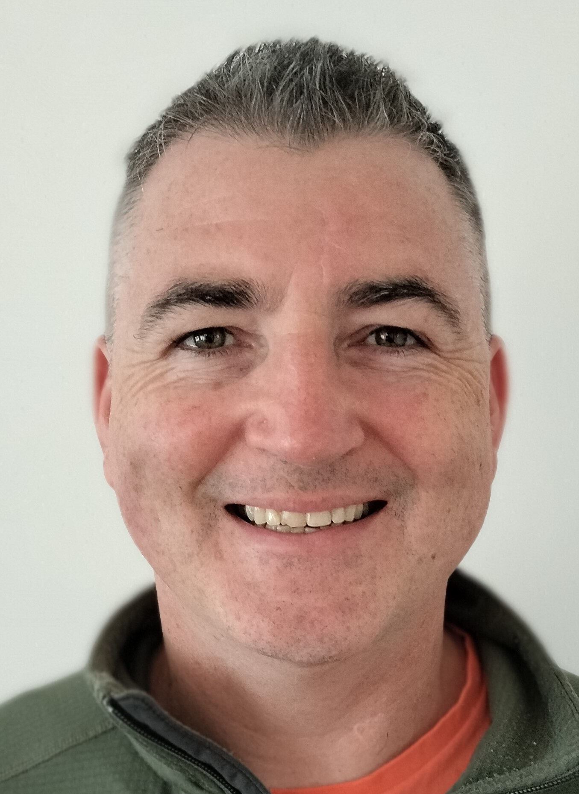

# Hello

## About Me

I am a Highly Technical Architect and Engineer with over 24 years experience in infrastructure design, deployment and management withy specialisms including strategy, cyber security, automation and cloud design/adoption.

In my day job I apply my ability to describe large complex challenges in straightforward, deliverable terms and leverage my deep technical experience to deliver value.

I am an experienced stakeholder, personnel, and technical manager, responsible for leading and mentoring teams.

Nothing pleases me more than nurturing talent and watching people develop in their careers.

## My Blog

My blog is a constant work in progress where I collate useful pieces of information that I use in my day job.

