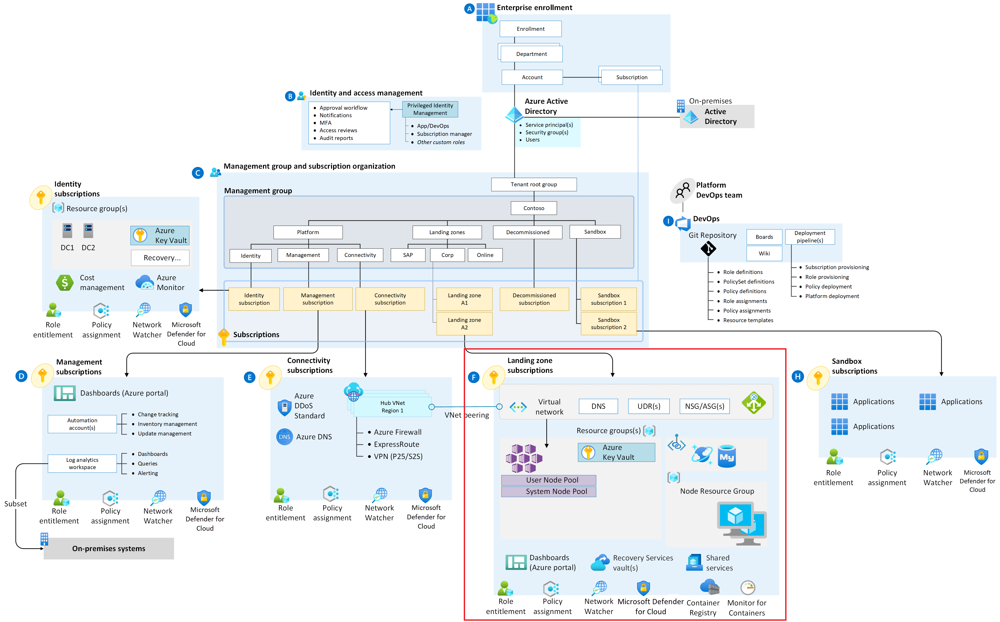

# AKS Landing Zone Accelerator

[Accelerator](https://learn.microsoft.com/en-us/azure/cloud-adoption-framework/scenarios/app-platform/aks/landing-zone-accelerator)

[Kubernetes: troubleshooting ingress and services traffic flows](https://medium.com/@ManagedKube/kubernetes-troubleshooting-ingress-and-services-traffic-flows-547ea867b120)