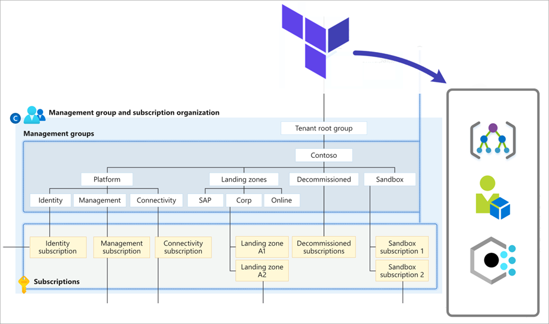
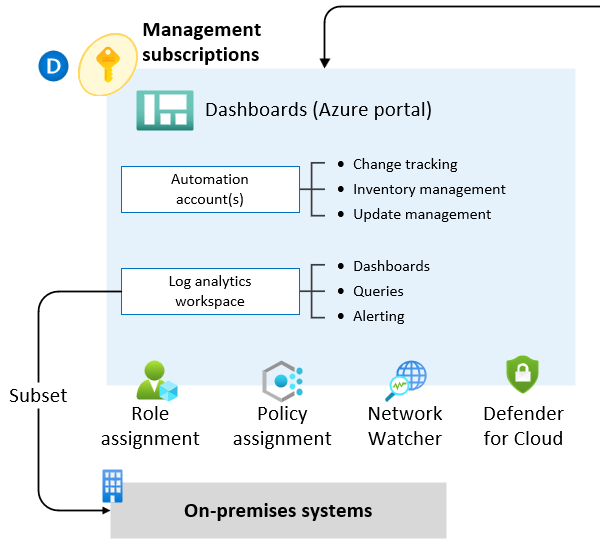

# landing zone accelerators

https://learn.microsoft.com/en-us/azure/cloud-adoption-framework/ready/landing-zone/implementation-options#azure-landing-zone-accelerator-approach

# Reference Implementations

https://learn.microsoft.com/en-us/azure/cloud-adoption-framework/ready/enterprise-scale/implementation#reference-implementation

## Azure landing zones Terraform module

https://learn.microsoft.com/en-us/azure/cloud-adoption-framework/ready/landing-zone/deploy-landing-zones-with-terraform!

### Deploy Core Resources

## Deploym Management Resources

