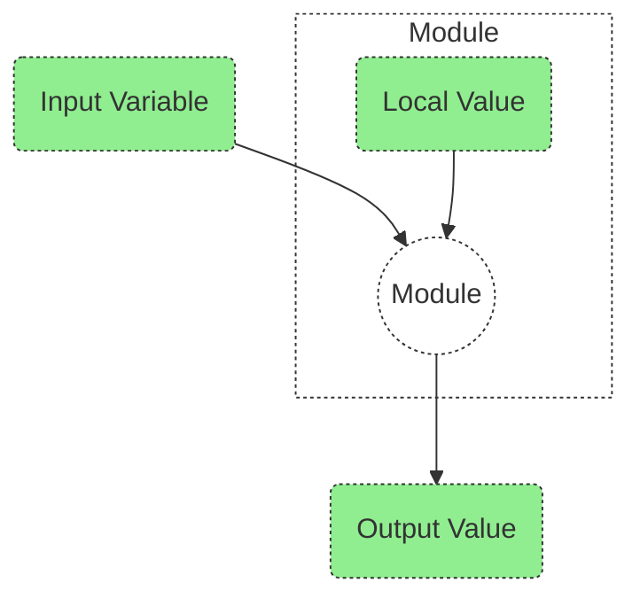

# Quick Intro To Terraform Variables

Terraform effectively has 3 variable types as depicted in the digram below.  You will note that the Output and Local are refered to a "Values", this is because - in part - their declaration syntax is different.



### In summary:
- <b>Input Variables</b> serve as parameters for a Terraform module, so users can customize behavior without editing the source.
- <b>Output Values</b> are like return values for a Terraform module.
- <b>Local Values</b> are a convenience feature for assigning a short name to an expression.


### Input Variable Example

Input Variables can have the following data types:
- string
- number
- bool

The type constructors allow you to specify complex types such as collections:

- list(<TYPE>)
- set(<TYPE>)
- map(<TYPE>)
- object({<ATTR NAME> = <TYPE>, ... })
- tuple([<TYPE>, ...])


Assume that we want to store a Virtual Network Name such as:

```python
virtual_network_name = "vnet-trans-p-001"
```

The syntax for declaring an input variable is as follows:

```python
variable "virtual_network_name"{
     type        = string
    description = "The name of the virtual network."

  validation {
    condition     = length(var.virtual_network_name) > 5 && substr(var.virtual_network_name, 0, 5) == "vnet-"
    error_message = "The virtual_network_name value must be a valid vNet Name, starting with \"vnet-\"."
  }
}
```

If we now run this with some incorrect values we get:

- Prefix incorrect:

```python
var.virtual_network_name is "vn-trans-p-001"
│
│ The virtual_network_name value must be a valid vNet Name, starting with "vnet-".
│
│ This was checked by the validation rule at variables.tf:5,3-13.
```

- Input too short:

```python
var.virtual_network_name is "vnet-"
│
│ The virtual_network_name value must be a valid vNet Name, starting with "vnet-".
│
│ This was checked by the validation rule at variables.tf:5,3-13.
```