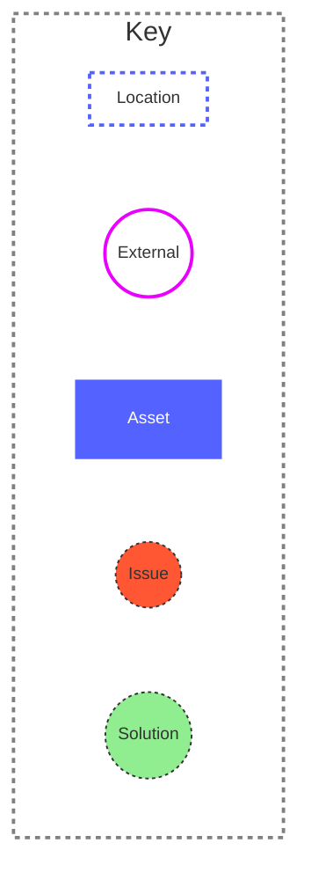
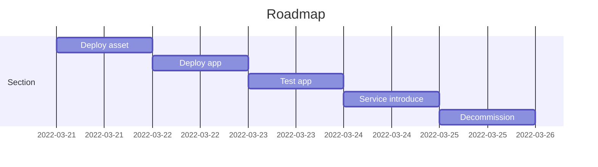

# Title: Cloud Deployment Design (Draft)

```tip
The purpose of this document is to provide the necessary technical details to an engineer to deploy the infrastructure.  For smaller applications this may be sufficient, for larger applications this will need to be supplemented within an overarching Solution Design.
```

##### Document Status
```note
The Document Status section is used to display the current status of the design, the options are: Draft, Ready for Review, Approved)
```

Document Status:   `Draft`

##### Revision Requests
```note
The revisions requests section is used to track requests changes to the design.
```

| Date | Section | Requested Change |  Authors Comments|
|--|--|--|--|
||  |  |  |
|  |  |  |  |
|  |  |  |  |

##### Version Control

```note
The version control section is used to capture design modifications.
```

|Version|Date| Author |Section Changed | Reason for Change|
|--|--|--|--|--|--|
|0.1 |01/09/2021  |Dermot Reynolds  |ALL  |Document Creation  |

## 1. Application Context

|Name                       |Value    |Description                              |
|---------------------------|---------|-----------------------------------------|
|Business Unit              |         |This is used to detemine the subscription|
|Application Name           |         |This is used to determine the names of the resources|
|Description                |         |                                         |
|Business Application Owner |         |Tag Value                                |
|Business Technical Owner   |         |Tag Value                                |
|Operational Owner          |         |Tag Value                                |


## 2. Requirements


| Requirement#  |Date | Description | Addressed By     | Reviewed Date  |
|---------------|-----|-------------|------------------|----------------|
|               |     |             |                  |                |


## 3. AS-IS

```note
If this is a transformation or migration please provide the AS-IS detail.
```

### 3.1 Physical Architecture

```mermaid
graph LR

    subgraph Group0["External"]
        Location0(("Customers")) -->
        Location1(("Cloud WAF")) -->
        Location2(("Internet"))
    end

        Location2 --> Device3
        Location2 --> Device4

        BadCallout1(("Tech Debt")) --> Device4
    subgraph Group5["Azure"]
            
        subgraph Group2["DMZ"]
            
            Device3["S-FINCO-WEB01"]
            Device4["S-FINCO-WEB02"]
        end

        subgraph Group4[" Prod "]
            Device6[S-FINCO-SQL01]
        end      
    end
    
        Device3-->Device6
        Device4-->Device6
    
     

    style Location0 fill:white,stroke:#E900FF,stroke-width:2px
 
    style Location1 fill:white,stroke:#E900FF,stroke-width:2px

    style Location2 fill:white,stroke:#E900FF,stroke-width:2px

    %% style Location4 fill:#ECECEC,stroke:#007fff,stroke-width:2px                

    %% style Device0 fill:#007fff,stroke:#007fff, stroke-width:2px , font-size: 80%, color: white
    %% style Device1 fill:white,stroke:#007fff,colour: white, stroke-width:1px , stroke-dasharray: 0
    
    %% style Device3 fill:white,stroke:#007fff,colour: white, stroke-width:1px , stroke-dasharray: 0        
    %% style Device4 fill:white,stroke:#007fff,colour: white, stroke-width:1px , stroke-dasharray: 0        
   
    %% style Device6 fill:white,stroke:#007fff,colour: white, stroke-width:1px , stroke-dasharray: 0     

     linkStyle 0 stroke:#90EE90,stroke-width:1.5px,color:blue;                       
     linkStyle 1 stroke:#90EE90,stroke-width:1.5px,color:blue;
     linkStyle 2 stroke:#90EE90,stroke-width:1.5px,color:blue;
     linkStyle 3 stroke:#90EE90,stroke-width:1.5px,color:blue;
     linkStyle 4 stroke:#90EE90,stroke-width:1.5px,color:blue;
     linkStyle 5 stroke:#90EE90,stroke-width:1.5px,color:blue;
     linkStyle 6 stroke:#90EE90,stroke-width:1.5px,color:blue;
    %% linkStyle 7 stroke:#90EE90,stroke-width:1.5px,color:blue;        
    %% linkStyle 8 stroke:#90EE90,stroke-width:1.5px,color:blue;            
    %% linkStyle 9 stroke:#90EE90,stroke-width:1.5px,color:blue;            


        style BadCallout1 fill:#FF5733	,stroke:#333,stroke-width:1px , stroke-dasharray: 2   

        class Device0,Device1,Device3,Device4,Device6 DeviceClass
        class Group0,Group1,Group2,Group4,Group5 GroupClass

        classDef DeviceClass fill:#5463FF,stroke:#5463FF, stroke-width:2px , font-size: 100%, color: white
        classDef GroupClass fill:#FFFFFF,stroke:#5463FF,stroke-width:2px, stroke-dasharray: 3
        %%style Device0 fill:white,stroke:#333,colour: white, stroke-width:1px , stroke-dasharray: 2
        %%style Group0 fill:#FFFFFF,stroke:#333,stroke-width:1px, stroke-dasharray: 2
        %%style Location0 fill:#F6F7F7,stroke:#0352FC,stroke-width:2px
        %%style WAN0 fill:#F6F7F7,stroke:#0352FC,stroke-width:2px
        %%style SUBS0 fill:#F6F7F7,stroke:#0352FC,stroke-width:2px
        %%style VNET0 fill:#54A8F9,stroke:#333,stroke-width:1px , color:#FFFFFF, stroke-dasharray: 2
        %%style SUBNET0 fill:#CDD2D6	,stroke:#333,stroke-width:1px , stroke-dasharray: 2
        %%style GoodCallout0 fill:#90EE90	,stroke:#333,stroke-width:1px , stroke-dasharray: 2
        %%style BadCallout0 fill:#FF5733	,stroke:#333,stroke-width:1px , stroke-dasharray: 2
        %%style USR0 fill:#F6F7F7,stroke:#0352FC,stroke-width:2px
        %%style UnsureCallout0 fill:#FFBB33	,stroke:#333,stroke-width:1px , stroke-dasharray: 2
```




### 3.2 Bill Of Materials

|               |S-FINCO-SQL01|S-FINCO-WEB01|S-FINCO-WEB02|
|---------------|-------------|-------------|-------------|
|Description    |             |             |             |
|Asset Type     |             |             |             |
|Sku            |             |             |             |
|OS             |             |             |             |
|Disks          |             |             |             |
|Tenant         |             |             |             |
|Subscription   |             |             |             |
|Resource Group |             |             |             |
|Virtual Network|             |             |             |
|Subnet         |             |             |             |


### 3.3 Key Statistics

|Statistic            | AS-IS       |
|---------------------|-------------|
|Resources            |         3   |
|Monthly Infra Cost   |       £1,000|
|Yearly Infra Cost    |      £12,000|
|1 Year TCO           |      £15,000|
|3 Year TCO           |      £45,000|


## 4. TO-BE

### 4.1 Identity & Access Management
#### 4.1.1 Privilege Access Management    
#### 4.1.2 Privilege Identity Management  
#### 4.1.3 Managed Identities             
#### 4.1.4 Service Principals             
#### 4.1.5 Role Base Access Control       

### 4.2 Protect & Recover
#### 4.2.1 Backup
#### 4.2.2 Disaster Recovery

### 4.3 Monitoring & Alerting
#### 4.3.1 Network Watcher
#### 4.3.2 Diagnostics / Log Analytics
#### 4.3.3 Application Insights
#### 4.3.4 Azure Monitor
#### 4.3.5 Alerts

### 4.4 Resource Organisation
#### 4.4.1 Subscription
#### 4.4.2 Management Group
#### 4.4.3 Resource Group
#### 4.4.4 Tagging


### 4.1 Physical Architecture

```mermaid
graph LR

    subgraph Group0["External"]
        Location0(("Customers")) -->
        Device0["WAF"]

    end
        Device0 --> Location1
        Location1(("Internet"))

        Location1 --> Device3
        Location1 --> Device4

        GoodCallout1(("PaaS")) --> Device4
    subgraph Group5["Azure"]
            
        subgraph Group2["DMZ"]
            
            Device3["S-FINCO-WEB01"]
            Device4["AS-FINCO-WWW01"]
        end

        subgraph Group4[" Prod "]
            Device6[S-FINCO-SQL01]
        end      
    end
    
        Device3-->Device6
        Device4-->Device6
    
     

    style Location0 fill:#ECECEC,stroke:#007fff,stroke-width:2px
 
    style Location1 fill:#ECECEC,stroke:#007fff,stroke-width:2px        

    %% style Location4 fill:#ECECEC,stroke:#007fff,stroke-width:2px                

    %% style Device0 fill:#007fff,stroke:#007fff, stroke-width:2px , font-size: 80%, color: white
    %% style Device1 fill:white,stroke:#007fff,colour: white, stroke-width:1px , stroke-dasharray: 0
    
    %% style Device3 fill:white,stroke:#007fff,colour: white, stroke-width:1px , stroke-dasharray: 0        
    %% style Device4 fill:white,stroke:#007fff,colour: white, stroke-width:1px , stroke-dasharray: 0        
   
    %% style Device6 fill:white,stroke:#007fff,colour: white, stroke-width:1px , stroke-dasharray: 0     

     linkStyle 0 stroke:#90EE90,stroke-width:1.5px,color:blue;                       
     linkStyle 1 stroke:#90EE90,stroke-width:1.5px,color:blue;
     linkStyle 2 stroke:#90EE90,stroke-width:1.5px,color:blue;
     linkStyle 3 stroke:#90EE90,stroke-width:1.5px,color:blue;
     linkStyle 4 stroke:#90EE90,stroke-width:1.5px,color:blue;
     linkStyle 5 stroke:#90EE90,stroke-width:1.5px,color:blue;
    %% linkStyle 6 stroke:#90EE90,stroke-width:1.5px,color:blue;
    %% linkStyle 7 stroke:#90EE90,stroke-width:1.5px,color:blue;        
    %% linkStyle 8 stroke:#90EE90,stroke-width:1.5px,color:blue;            
    %% linkStyle 9 stroke:#90EE90,stroke-width:1.5px,color:blue;            


        style GoodCallout1 fill:#90EE90	,stroke:#333,stroke-width:1px , stroke-dasharray: 2

        class Device0,Device1,Device3,Device4,Device6 DeviceClass
        class Group0,Group1,Group2,Group4,Group5 GroupClass

        classDef DeviceClass fill:#5463FF,stroke:#5463FF, stroke-width:2px , font-size: 100%, color: white
        classDef GroupClass fill:#FFFFFF,stroke:#5463FF,stroke-width:2px, stroke-dasharray: 3
        %%style Device0 fill:white,stroke:#333,colour: white, stroke-width:1px , stroke-dasharray: 2
        %%style Group0 fill:#FFFFFF,stroke:#333,stroke-width:1px, stroke-dasharray: 2
        %%style Location0 fill:#F6F7F7,stroke:#0352FC,stroke-width:2px
        %%style WAN0 fill:#F6F7F7,stroke:#0352FC,stroke-width:2px
        %%style SUBS0 fill:#F6F7F7,stroke:#0352FC,stroke-width:2px
        %%style VNET0 fill:#54A8F9,stroke:#333,stroke-width:1px , color:#FFFFFF, stroke-dasharray: 2
        %%style SUBNET0 fill:#CDD2D6	,stroke:#333,stroke-width:1px , stroke-dasharray: 2
        %%style GoodCallout0 fill:#90EE90	,stroke:#333,stroke-width:1px , stroke-dasharray: 2
        %%style BadCallout0 fill:#FF5733	,stroke:#333,stroke-width:1px , stroke-dasharray: 2
        %%style USR0 fill:#F6F7F7,stroke:#0352FC,stroke-width:2px
        %%style UnsureCallout0 fill:#FFBB33	,stroke:#333,stroke-width:1px , stroke-dasharray: 2
```



### 4.2 Bill Of Materials

|               |S-FINCO-SQL01|S-FINCO-WEB01|AS-FINCO-WWW01|
|---------------|-------------|-------------|-------------|
|Description    |             |             |             |
|Asset Type     |             |             |             |
|Sku            |             |             |             |
|OS             |             |             |             |
|Disks          |             |             |             |
|Tenant         |             |             |             |
|Subscription   |             |             |             |
|Resource Group |             |             |             |
|Virtual Network|             |             |             |
|Subnet         |             |             |             |

### 4.3 Key Statistics

|Statistic            |    TO-BE    |
|---------------------|-------------|
|Resources            |            3|
|Monthly Infra Cost   |       £500  |
|Yearly Infra Cost    |      £6,000 |
|1 Year TCO           |      £9,000 |
|3 Year TCO           |      £27,000|

## 8 AS-IS vs TO-BE Comparison


### 8.1 Bill Of Materials


### 8.2 Key Statistics

|Statistic            | AS-IS       |    TO-BE    |Delta      |
|---------------------|-------------|-------------|-----------|
|Resources            |            3|            3| 0         |
|Monthly Infra Cost   |       £1,000|        £500 |      -£500|
|Yearly Infra Cost    |      £12,000|       £6000 |    -£6000 |
|1 Year TCO           |      £15,000|       £9000 |    -£6000 |
|3 Year TCO           |      £45,000|      £27000 |   -£18000 |

## 9 Implementation

### 9.1 Activities

|#   |Start Date|End Date  | Associated Resource | Activity         | Assigned Resource | Status     |
|----|----------|----------|---------------------|------------------|-------------------|------------|
|T1  |21/03/22  |21/03/22  |AS-FINCO-WWW01       |Deploy asset      | john@dlta.io      | `TO-DO`    |
|T2  |22/03/22  |22/03/22  |AS-FINCO-WWW01       |Deploy app        | john@dlta.io      | `TO-DO`    |
|T3  |23/03/22  |23/03/22  |AS-FINCO-WWW01       |Test app          | john@dlta.io      | `TO-DO`    |
|T4  |24/03/22  |24/03/22  |AS-FINCO-WWW01       |Service introduce | john@dlta.io      | `TO-DO`    |
|T5  |25/03/22  |25/03/22  |S-FINCO-WEB02        |Decommission      | john@dlta.io      | `TO-DO`    |

### 9.2 Roadmap



### Appendix A - Naming Conventions

https://learn.microsoft.com/en-us/azure/architecture/landing-zones/subscription-vending