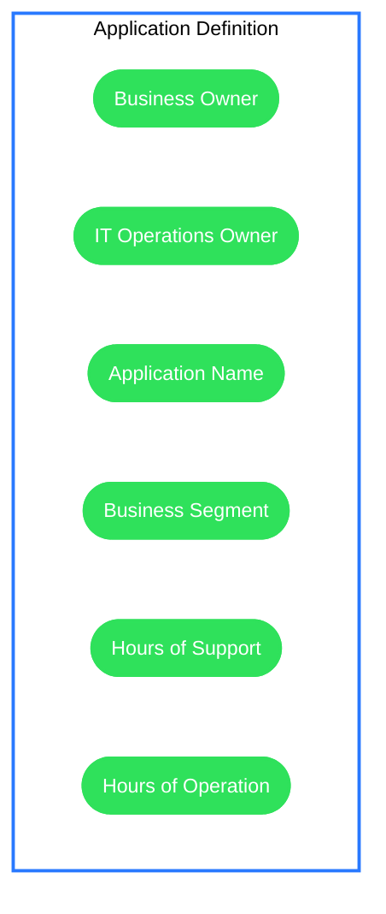

# Application Deployment Design Template (Draft)

```tip
This template is based on a combination of personal experience and for Azure Landing Zone design area of the Microsoft Cloud Adoption Framework for Azure.

It should cover or use inputs from the items below.

Feel free to use it and adopt it for your purposes.

```


#### Document Status

Document Status:   **`Draft`**      *(Options are: `Draft`, `Ready for Review`, `Approved` )*

#### Revision Requests
```note
The revisions requests section is used to track requests changes to the design.
```

| Date | Section | Requested Change |  Authors Comments|
|--|--|--|--|
|  |  |  |  |
|  |  |  |  |
|  |  |  |  |

#### Version Control

```note
The version control section is used to capture design modifications.
```

|Version|Date| Author |Section Changed | Reason for Change|
|--|--|--|--|--|--|
|0.1 |01/09/2021  |Dermot Reynolds  |ALL  |Document Creation  |

## 1. Application Definition



|Name                       |Value    |Description                              |
|---------------------------|---------|-----------------------------------------|
|Business Unit              |         |This is used to detemine the subscription|
|Application Name           |         |This is used to determine the names of the resources|
|Description                |         |                                         |
|Business Application Owner |         |Tag Value                                |
|Business Technical Owner   |         |Tag Value                                |
|Operational Owner          |         |Tag Value                                |


## 2. Requirements


### 2.1 Functional & Non-Functional Requirements

| Requirement#  |Functional/NFR|Date | Description | Addressed By     | Reviewed Date  |
|---------------|--------------|-----|-------------|------------------|----------------|
|               |              |     |             |                  |                |

### 2.2 Seasonality

`Is this application or elements of it, busier at specific times of the day or year?  Are there key events that take place at specific times?`


## 3. Current Mode Of Operation


```note
If this is a transformation or migration please provide the AS-IS detail.
```

### 3.1 Physical Architecture


### 3.2 Assets

|               |S-FINCO-SQL01|S-FINCO-WEB01|S-FINCO-WEB02|
|---------------|-------------|-------------|-------------|
|Description    |             |             |             |
|Asset Type     |             |             |             |
|Sku            |             |             |             |
|OS             |             |             |             |
|Disks          |             |             |             |
|Tenant         |             |             |             |
|Subscription   |             |             |             |
|Resource Group |             |             |             |
|Virtual Network|             |             |             |
|Subnet         |             |             |             |

### 3.3 Issues


## 4. Future Mode Of Operation

### 4.1 Identity & Access Management

#### 4.1.1 Privilege Access Management    
#### 4.1.2 Privilege Identity Management  
#### 4.1.3 Managed Identities             
#### 4.1.4 Service Principals             
#### 4.1.5 Role Base Access Control       

### 4.2 Protect & Recover
#### 4.2.1 Backup
#### 4.2.2 Disaster Recovery

### 4.3 Monitoring & Alerting
#### 4.3.1 Network Watcher
#### 4.3.2 Diagnostics / Log Analytics
#### 4.3.3 Application Insights
#### 4.3.4 Azure Monitor
#### 4.3.5 Alerts

### 4.4 Resource Organisation
#### 4.4.1 Subscription
#### 4.4.2 Management Group
#### 4.4.3 Resource Group
#### 4.4.4 Tagging

### 4.5 Governance
#### 4.5.1 Cost Management
##### 4.5.1.1 AS-IS Cost

|Statistic            | AS-IS       |
|---------------------|-------------|
|Resources            |         3   |
|Monthly Infra Cost   |       £1,000|
|Yearly Infra Cost    |      £12,000|
|1 Year TCO           |      £15,000|
|3 Year TCO           |      £45,000|

##### 4.5.1.2 TO-BE Cost

|Statistic            |    TO-BE    |
|---------------------|-------------|
|Resources            |            3|
|Monthly Infra Cost   |       £500  |
|Yearly Infra Cost    |      £6,000 |
|1 Year TCO           |      £9,000 |
|3 Year TCO           |      £27,000|

##### 4.5.1.3 Cost Comparison

##### 4.5.1.4 Budget

#### 4.5.2 Capacity Management
#### 4.5.3 Azure Policy

### 4.6 Security
#### 4.6.1 Network Security Groups
#### 4.6.2 Firewall Rules
#### 4.6.3  DDoS
#### 4.6.4  WAF
#### 4.6.5  Security Center
#### 4.6.6  Sentinel
#### 4.6.7  Secrets Management
#### 4.6.8  Encryption

### 4.7 Networking
#### 4.7.1 Virtual Network
#### 4.7.2 Subnet
#### 4.7.3 Route Table

### 4.8 Dependencies
#### 4.8.1 Platform Dependencies
#### 4.8.2 DNS
#### 4.8.3 Application Dependencies 

### 4.9 DevOps
#### 4.9.1 Infrastructure Deployment
#### 4.9.2 Application Deployment

### 4.10 Architecture

#### 4.10.1 Environments

#### 4.10.2 Context

``Diagram showing where this application sits``

#### 4.10.3 Physical Architecture


#### 4.10.3 Bill Of Materials

|               |S-FINCO-SQL01|S-FINCO-WEB01|AS-FINCO-WWW01|
|---------------|-------------|-------------|-------------|
|Description    |             |             |             |
|Asset Type     |             |             |             |
|Sku            |             |             |             |
|OS             |             |             |             |
|Disks          |             |             |             |
|Tenant         |             |             |             |
|Subscription   |             |             |             |
|Resource Group |             |             |             |
|Virtual Network|             |             |             |
|Subnet         |             |             |             |

### 4.11 Optimisations

```tip
If you were looking to optimise this solution in 12 months time what aspects would you consider?

Are there any features that can be implemented to make this solution more efficient?
Can we right size workloads at specific times of the day?
Have we used a specific sku that provides greater flexibility?
Have we added additional features to make it easier to troubleshoot?
```

#### 4.11.1 Cost

#### 4.11.1 Management

#### 4.11.1 Viability

#### 4.11.1 Refactoring

### 4.12 Service Introduction / Handover

```tip
If you were asked to support this in 12 months time at 3am what material would you look at?
```
#### 4.12.1 Training Videos

#### 4.12.2 How Tos


## Appendix A - References

### Subscription Vending
https://learn.microsoft.com/en-us/azure/architecture/landing-zones/subscription-vending

### Security Best Practice
https://learn.microsoft.com/en-us/azure/security/fundamentals/best-practices-and-patterns

### Azure Landing Zones

https://learn.microsoft.com/en-us/azure/cloud-adoption-framework/ready/landing-zone/