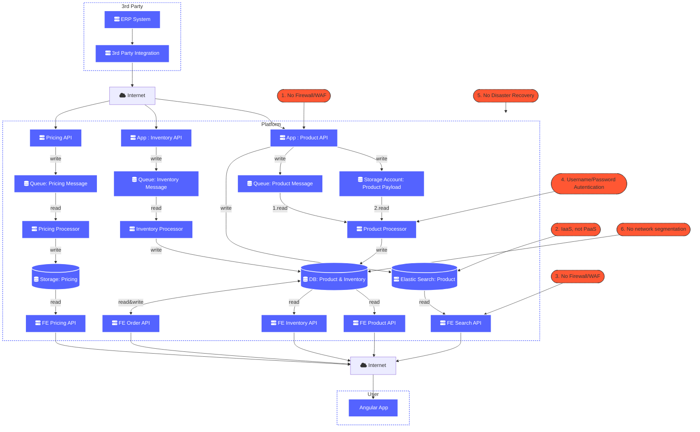
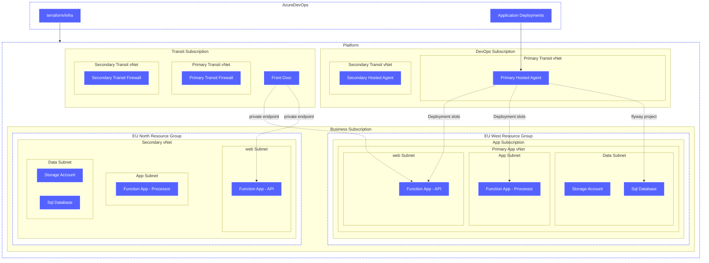
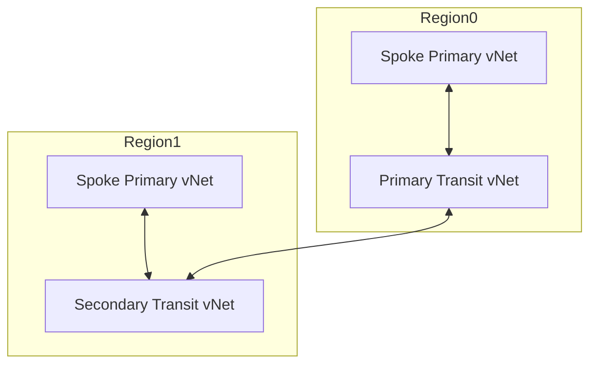

# Other Stuff

## AS-IS

## TO-BE (Summarised, Prod Only)

### 1. Security
- All services are "behind" the Front Door
- 

### 1. Scalability
- PaaS services can scale on demand.

### Reliability

### Deployability

### Availability

### Maintainability