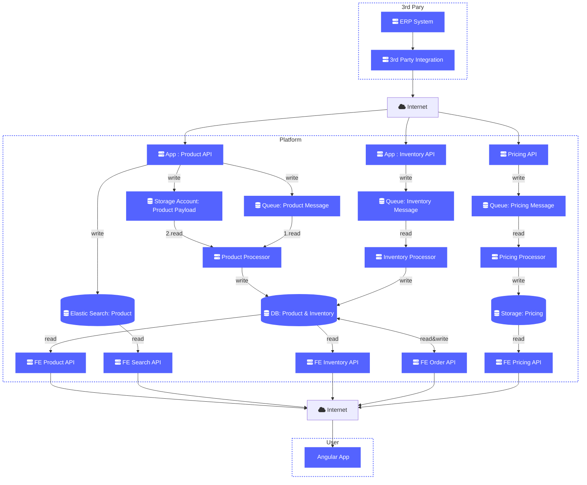

# Other Stuff

```mermaid
flowchart TD

    subgraph Group0[3rd Pary]
        d1[fa:fa-server ERP System]:::DeviceClass -->
        d2[fa:fa-server 3rd Party Integration]:::DeviceClass
    end

        d99[fa:fa-cloud Internet]
        d100[fa:fa-cloud Internet]

    subgraph Group1[Platform]
        d10[fa:fa-server App : Product API]:::DeviceClass 
        
        d10 -->|write|d11[fa:fa-database Storage Account: Product Payload]:::DeviceClass
        d10 --> |write|d12[fa:fa-database Queue: Product Message]:::DeviceClass
        d10 --> |write|d16[(fa:fa-database Elastic Search: Product)]:::DeviceClass

        d13[fa:fa-server Product Processor]:::DeviceClass

        d11 --> |2.read|d13
        d12 --> |1.read|d13

        
        d13 --> |write|d15[fa:fa-database DB: Product & Inventory]:::DeviceClass


        d20[fa:fa-server App : Inventory API]:::DeviceClass --> |write|d22[fa:fa-database Queue: Inventory Message]:::DeviceClass

        d23[fa:fa-server Inventory Processor]:::DeviceClass

        d22 --> |read|d23

        d23 --> |write|d15[(fa:fa-database DB: Product & Inventory)]:::DeviceClass


        d30[fa:fa-server Pricing API]:::DeviceClass --> |write|d32[fa:fa-database Queue: Pricing Message]:::DeviceClass

        d33[fa:fa-server Pricing Processor]:::DeviceClass

        d32 --> |read|d33

        d33 --> |write|d35[(fa:fa-database Storage: Pricing)]:::DeviceClass
       
        d15 -->|read|d40[fa:fa-server FE Product API]:::DeviceClass
        d16-->|read|d41[fa:fa-server FE Search API]:::DeviceClass
        d15 -->|read|d42[fa:fa-server FE Inventory API]:::DeviceClass
        d15 <-->|read&write|d43[fa:fa-server FE Order API]:::DeviceClass
        d35 -->|read|d44[fa:fa-server FE Pricing API]:::DeviceClass
    end

    subgraph Group2[User]
        d50[fa:fa-browser Angular App]:::DeviceClass
    end

    d40 -->d100
    d41 -->d100
    d42 -->d100
    d43 -->d100
    d44 -->d100

    d100 --> d50


    d2 --> d99 --> d10
            d99 --> d20
            d99 --> d30

    %% class d1,d2,d3,d4,1.5,1.6,1.7,1.8 DeviceClass
    class 1.1.1 DeviceClass
    class 2.1,2.2,2.3,2.4 GoodCalloutClass
    class Group0,Group1,Group2 GroupClass
    
    classDef DeviceClass fill:#5463FF,stroke:#5463FF, stroke-width:2px , font-size: 100%, color: white
    classDef GroupClass fill:#FFFFFF,stroke:#5463FF,stroke-width:2px, stroke-dasharray: 3
    classDef GoodCalloutClass fill:#90EE90	,stroke:#333,stroke-width:1px , stroke-dasharray: 2
```