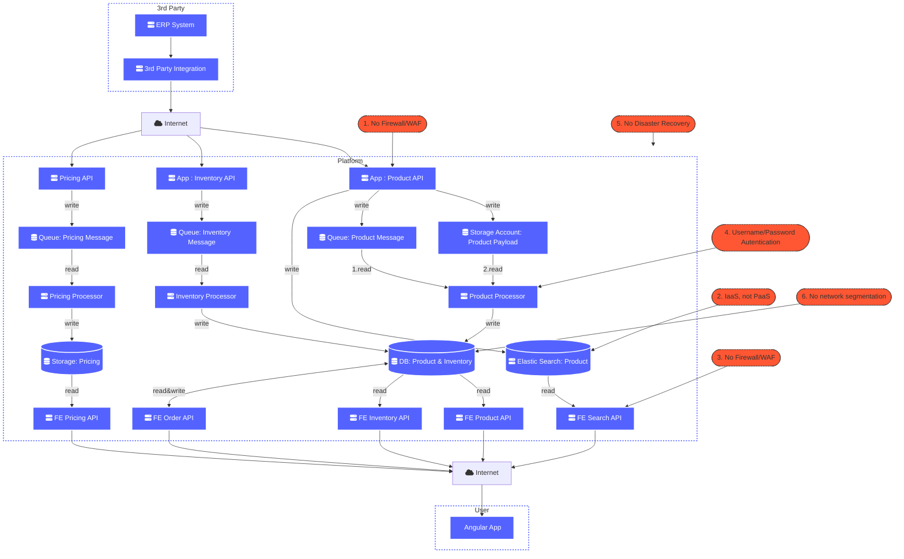

# Solution Design Example

## 1. Document Status
```note
The Document Status section is used to display the current status of the design, the options are: Draft, Ready for Review, Approved)
```

Document Status:   `Approved`

## 2. Project Properties

### 2.1 Organisation Properties

|Name                       |Value    |
|---------------------------|---------|
|Company                    |         |
|Segment                    |         |
|Program Sponsor            |         |

### 2.2 Project Properties

|Name                       |Value    |
|---------------------------|---------|
|Project Title              |         |
|Project Description        |         |
|Business Application Owner |         |
|Business Technical Owner   |         |
|Operational Owner          |         |

### 2.3 TCO Properties

|Name                       |Value    |
|---------------------------|---------|
|Support/instance/year      | £1,000  |

## 3. Revision Requests
```note
The revisions requests section is used to track requests changes to the design.
```

| Date | Section | Requested Change |  Authors Comments|
|--|--|--|--|
||  |  |  |
|  |  |  |  |
|  |  |  |  |

## 4. Version Control

```note
The version control section is used to capture design modifications.
```

|Version|Date| Author |Section Changed | Reason for Change|
|--|--|--|--|--|--|
|0.1 |01/09/2021  |Dermot Reynolds  |ALL  |Document Creation  |

## 5. Requirements

| Requirement#  |Date | Description | Addressed By     | Reviewed Date  |
|---------------|-----|-------------|------------------|----------------|
|               |     |             |                  |                |


## 6. AS-IS

### 6.1 Physical Architecture




### 6.2 Bill Of Materials

|               |S-FINCO-SQL01|S-FINCO-WEB01|S-FINCO-WEB02|
|---------------|-------------|-------------|-------------|
|Description    |             |             |             |
|Asset Type     |             |             |             |
|Sku            |             |             |             |
|OS             |             |             |             |
|Disks          |             |             |             |
|Tenant         |             |             |             |
|Subscription   |             |             |             |
|Resource Group |             |             |             |
|Virtual Network|             |             |             |
|Subnet         |             |             |             |


### 6.3 Key Statistics

|Statistic            | AS-IS       |
|---------------------|-------------|
|Resources            |         3   |
|Monthly Infra Cost   |       £1,000|
|Yearly Infra Cost    |      £12,000|
|1 Year TCO           |      £15,000|
|3 Year TCO           |      £45,000|


## 7. TO-BE

### 7.1 Physical Architecture


#### Features

##### Security
1.  Only internet facing service is Front Door.
1.1.  All other services are not accessible over the internet.
2.  All application tiers are on different subnets.
2.1 Traffic between subnets is restricted via NSG.
3.  Policies enforce security standards.

##### Deployability
1.  All infrastructure is deployed using IaC(terraform)
2.  Blue/green deployments via Slots
`resource "azurerm_app_service_active_slot" "slotDemoActiveSlot" {...}`

##### Scalability
1.  Elastic Search Changed from IaaS(3 node) to PaaS.
2.  All PaaS elements can scale out.


### 7.2 Bill Of Materials

|               |S-FINCO-SQL01|S-FINCO-WEB01|AS-FINCO-WWW01|
|---------------|-------------|-------------|-------------|
|Description    |             |             |             |
|Asset Type     |             |             |             |
|Sku            |             |             |             |
|OS             |             |             |             |
|Disks          |             |             |             |
|Tenant         |             |             |             |
|Subscription   |             |             |             |
|Resource Group |             |             |             |
|Virtual Network|             |             |             |
|Subnet         |             |             |             |

### 7.3 Key Statistics

|Statistic            |    TO-BE    |
|---------------------|-------------|
|Resources            |            3|
|Monthly Infra Cost   |       £500  |
|Yearly Infra Cost    |      £6,000 |
|1 Year TCO           |      £9,000 |
|3 Year TCO           |      £27,000|

## 8 AS-IS vs TO-BE Comparison


### 8.1 Bill Of Materials


### 8.2 Key Statistics

|Statistic            | AS-IS       |    TO-BE    |Delta      |
|---------------------|-------------|-------------|-----------|
|Resources            |            3|            3| 0         |
|Monthly Infra Cost   |       £1,000|        £500 |      -£500|
|Yearly Infra Cost    |      £12,000|       £6000 |    -£6000 |
|1 Year TCO           |      £15,000|       £9000 |    -£6000 |
|3 Year TCO           |      £45,000|      £27000 |   -£18000 |

## 9 Implementation

### 9.1 Activities

|#   |Start Date|End Date  | Associated Resource | Activity         | Assigned Resource | Status     |
|----|----------|----------|---------------------|------------------|-------------------|------------|
|T1  |21/03/22  |21/03/22  |AS-FINCO-WWW01       |Deploy asset      | john@dlta.io      | `TO-DO`    |
|T2  |22/03/22  |22/03/22  |AS-FINCO-WWW01       |Deploy app        | john@dlta.io      | `TO-DO`    |
|T3  |23/03/22  |23/03/22  |AS-FINCO-WWW01       |Test app          | john@dlta.io      | `TO-DO`    |
|T4  |24/03/22  |24/03/22  |AS-FINCO-WWW01       |Service introduce | john@dlta.io      | `TO-DO`    |
|T5  |25/03/22  |25/03/22  |S-FINCO-WEB02        |Decommission      | john@dlta.io      | `TO-DO`    |

### 9.2 Roadmap

