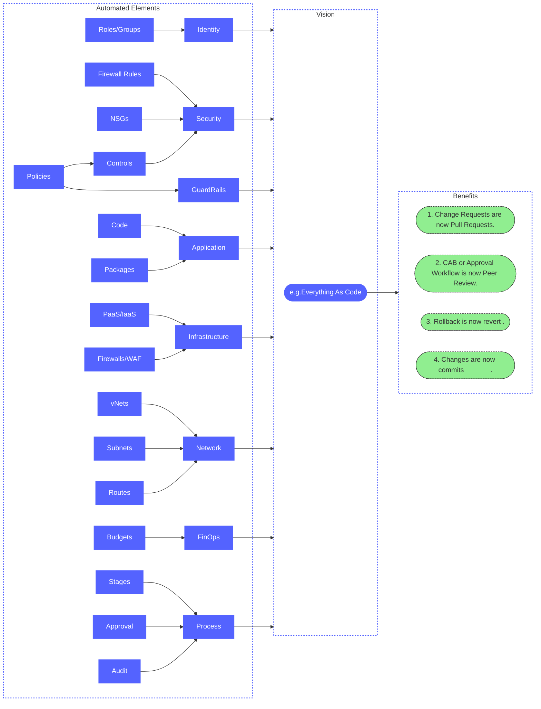

# DevOps Adoption (Right To Left Thinking)

If you adopting or maturing Infrastructure As Code principles in your organisation it is a good idea to define what your Vision is and determine what you are going to automate to realise your Vision.

A good reference architecture for "Everying in Cloud" is the [Cloud Adoption Framework](https://learn.microsoft.com/en-us/azure/cloud-adoption-framework/ready/landing-zone/design-areas).  You can use this to guide you on the aspects of Cloud that should be automated.

Below are the types of Cloud aspects which are typically automated to varying degrees.

