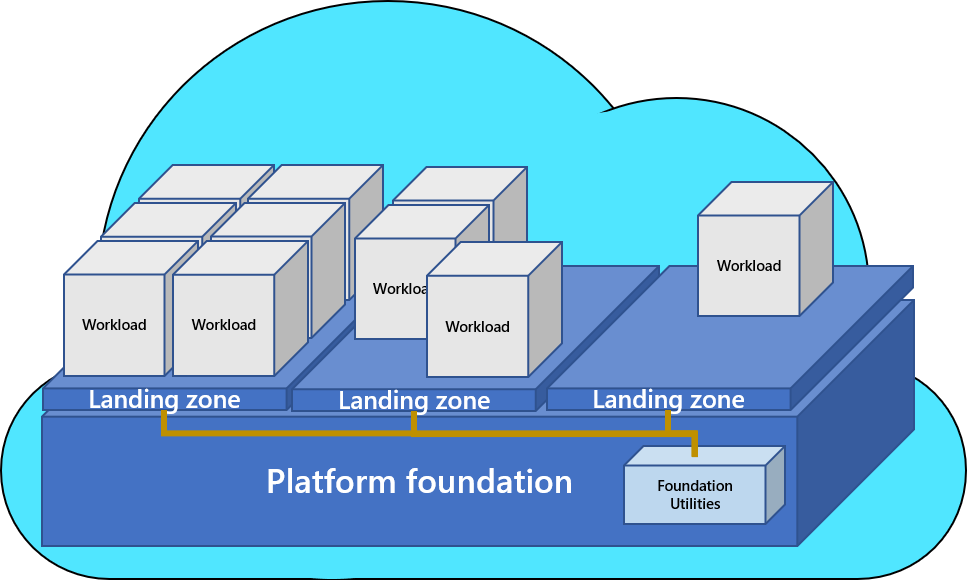

# Operating Model

Adopting the cloud creates an opportunity to revisit how you operate technological systems. It is an opportunity to give greater autonomy to teams to carry out their work with reduced process impediments and therefore greater pace.  It is also an opportunity to define who is responsible for and therefore can specialise in different aspects of cloud.

Defining your Operating Model is therefore a key prerequisite to deploying or rationalising your cloud as this will inform how the infrastructure and supporting elements are built and managed. It also informs who needs to be on the journey and the key role that they play in its success.  Not defining a clear Operating Model can have negative outcomes such as poor security, out of control cost and increased complexity.

The [Cloud Adoption Framework](https://learn.microsoft.com/en-us/azure/cloud-adoption-framework/operating-model/compare) defines 4 common Operating Models as depicted below.

A typical Operating Model employed by organisations is [Enterprise operations
](https://learn.microsoft.com/en-us/azure/cloud-adoption-framework/operating-model/compare#enterprise-operations) as depicted in more detail below.

In this architecture workload teams are granted greater autonomy to drive innovation, within well-defined guardrails.

There are 3 key advantages to this model:

- **Landing zone design** 

Landing zone design replicates the needs of the portfolio, creating clear security, governance, and accountability boundaries. These boundaries are required to operate workloads in the cloud. Segmentation practices are unlikely to resemble the constraints created by preceding datacenter designs. In enterprise operations, landing-zone design is less complex, allowing for faster scale and reduced barriers to self-service demand.

- **Foundational utilities** 

Foundational utilities are hosted in separate centrally controlled subscriptions, known as the platform foundation. Central tools are then piped into each landing zone as utility services. Separating foundational utilities from the landing zones maximizes consistency and economy of scale. These utilities also create clear distinctions between centrally managed responsibilities and workload level responsibilities.

- **Separation of duties**

Clear separation of duties between foundational utilities and landing zones is one of the biggest advantages in the operations approach. Cloud-native tools and processes support access and proper balance of control between centralized teams and workload teams. This approach is based on the requirements of individual landing zones and workloads hosted in landing zone segments.