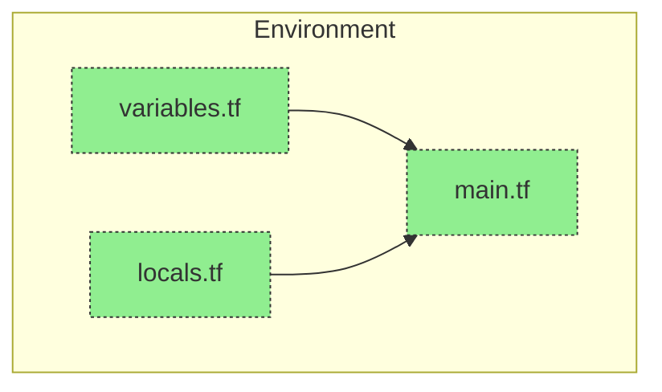

# Terraform Experimenting

To run the majority of examples in this area you you do not need a cloud subscription.
You only need to download terraform and create the below 3 files.



```bash
terraform apply -var-file="./variables.tfvars"
```