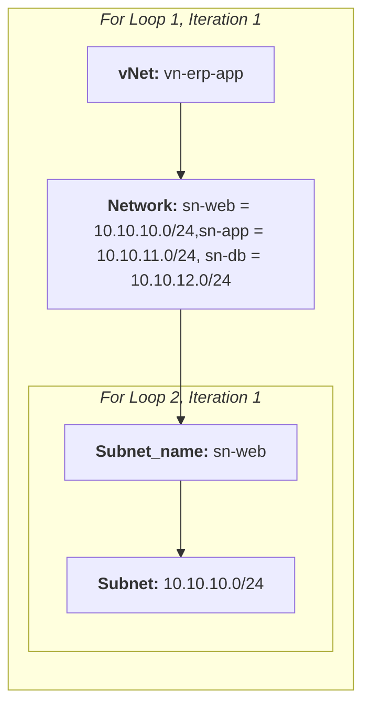

# Terraform For Loop

The syntax of a `for` loop changes depending on whether you are processing a `map` or a `list`.

As a reminder, a simple map comprises of a key and value as depicted below.

```terraform
# variables.tf

simplemapvariable = {
    Key = "Value",
  }
```

A map of map comprises of key and value inside a key as depicted below.

```terraform
# variables.tf

simplemapmapvariable ={
    "Key1" = {
      Key2 = "Value2"
    }
  }
```

To loop over this map of map structure you will need 2 for loops:

```terraform
# main.tf

output "c_simplemapvariable_6" {
  value = flatten([
      for Key1, Value1 in var.vnets : [   # First for loop
        for Key2,Value2 in Value1 : {     # Second for loop
          subnet_name = Key2
          subnet = Value2
          vnet = Key1
        }
    ]
  ])
}
```

### 1. Worked Example.

Assuming you have a list of virtual networks or VPCs that contain subnets like the below

```terraform
# variables.tfvars

vnets ={
    "vn-erp-app" = {
      sn-web = "10.10.10.0/24",
      sn-app = "10.10.11.0/24"
      sn-db = "10.10.12.0/24"
    },
    "vn-crm-app" = {
      sn-web = "10.10.20.0/24",
      sn-app = "10.10.21.0/24"
      sn-db = "10.10.22.0/24"
    }
  }
```

```terraform
# variables.tf

variable "vnets"{
    type = map(map(string))
}
```

To iterate over this structure you will need to perform 2 loops, as depicted below.



This is reflected in the following code:

```terraform
# main.tf

output "c_simplemapvariable_5" {
  value = flatten([
      for vNet, Network in var.vnets : [
        for Subnet_name,Subnet in Network : {
          subnet_name = Subnet_name
          subnet = Subnet
          vnet = vNet
        }
    ]
  ])
}
```

```console
c_simplemapvariable_5 = [
  {
    "subnet" = "10.10.21.0/24"
    "subnet_name" = "sn-app"
    "vnet" = "vn-crm-app"
  },
  {
    "subnet" = "10.10.22.0/24"
    "subnet_name" = "sn-db"
    "vnet" = "vn-crm-app"
  },
  {
    "subnet" = "10.10.20.0/24"
    "subnet_name" = "sn-web"
    "vnet" = "vn-crm-app"
  },
  {
    "subnet" = "10.10.11.0/24"
    "subnet_name" = "sn-app"
    "vnet" = "vn-erp-app"
  },
  {
    "subnet" = "10.10.12.0/24"
    "subnet_name" = "sn-db"
    "vnet" = "vn-erp-app"
  },
  {
    "subnet" = "10.10.10.0/24"
    "subnet_name" = "sn-web"
    "vnet" = "vn-erp-app"
  },
]
```
